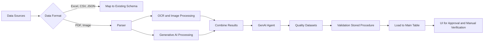

# Data Ingestion Pipeline

This data ingestion pipeline is designed to extract data from various sources such as Excel, PDF, CSV, and API, process the data using OCR, image processing, and generative AI techniques, and load the validated data into a main table for further processing and manual verification.

## Pipeline Flow

## Pipeline Components

1. **Data Sources**: The pipeline supports various data sources such as Excel, PDF, CSV, and API.

2. **Data Format**: The data format is determined, and the pipeline branches based on the format.

3. **Mapping**: For Excel, CSV, and JSON formats, the data is mapped directly to the existing schema.

4. **Parser**: For PDF and image formats, a parser is used to extract the relevant data.

5. **OCR and Image Processing**: The parser utilizes Tesseract OCR and image processing libraries to extract text from the PDF and image files.

6. **Generative AI Processing**: The extracted data is further processed using generative AI techniques to extract relevant information and convert it into a JSON format.

7. **Combine Results**: The results from OCR, image processing, and generative AI are combined.

8. **GenAI Agent**: The combined results are passed through a GenAI agent to create quality datasets.

9. **Validation**: A validation stored procedure is run to ensure the data is validated.

10. **Load to Main Table**: The validated data is loaded into the main table for further processing and manual verification.

11. **UI for Approval**: A user interface is provided for manual verification and approval of the loaded data.

## ETL Solution

While Azure Data Factory (ADF) is a popular ETL solution, there are alternative cost-effective solutions available in Python using PostgreSQL database. Here are a few options:

1. **Apache Airflow**: Apache Airflow is an open-source platform for programmatically creating, scheduling, and monitoring workflows. It allows you to define complex ETL pipelines using Python scripts and provides a web-based UI for monitoring and managing the workflows.

2. **Luigi**: Luigi is another open-source Python package for building complex pipelines of batch jobs. It provides a simple and intuitive way to define tasks and their dependencies, making it easy to create and manage ETL workflows.

3. **Prefect**: Prefect is a modern data workflow platform that allows you to define, schedule, and monitor data pipelines using Python. It provides a clean and expressive API for defining workflows and offers features like task retries, error handling, and parallel execution.

These solutions can be used in combination with Python libraries like Pandas, NumPy, and OpenCV for data manipulation, image processing, and OCR tasks. PostgreSQL can be used as the target database for storing the processed and validated data.
